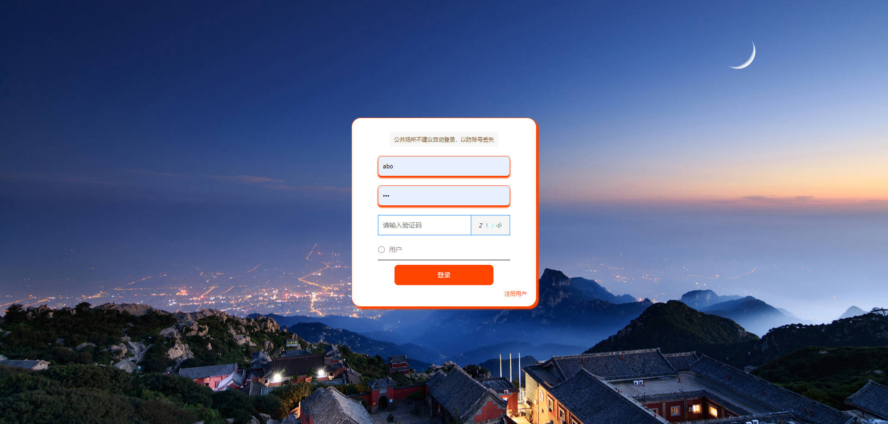
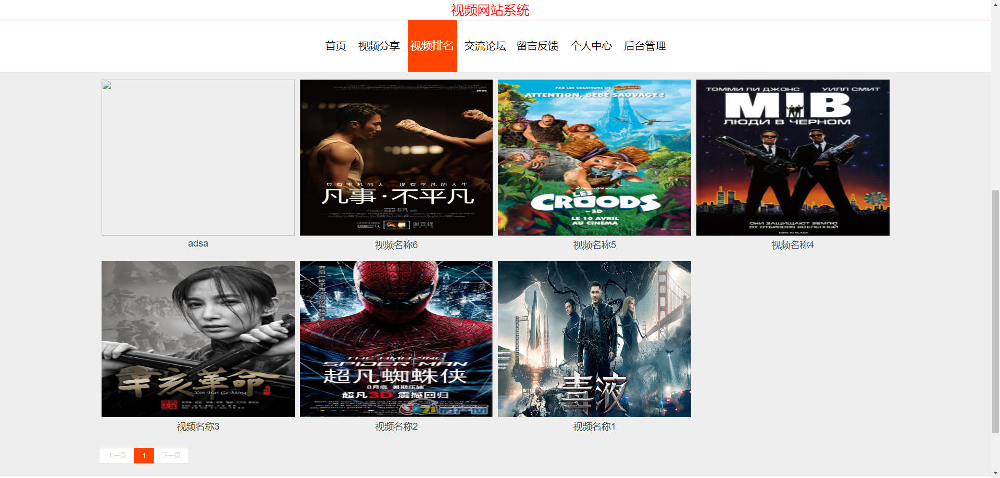
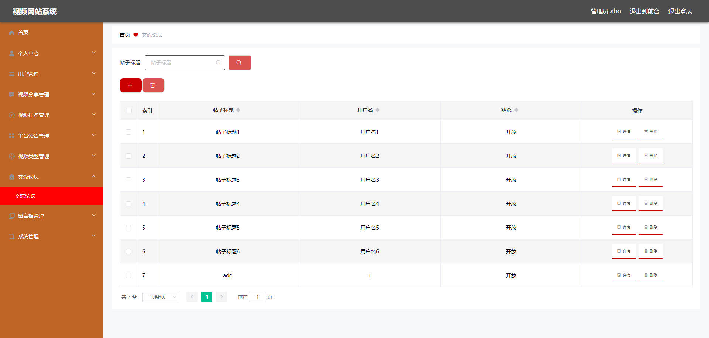

# 基于Springboot的视频网站系统

## Springboot-0069


## 技术栈

Springboot mybatisplus vue mysql maven


## 数据库表(13张)


## 功能介绍

```properties
管理员功能有个人中心，用户管理，视频分享管理，视频排名管理，平台公告管理，视频类型管理，交流论坛管理，留言板管理，系统管理等。

用户功能有个人中心和视频分享管理
```


## 图片

### 前台







### 后台




## 访问路径

### 前台

```properties
http://localhost:8080/springbootpist4/front/pages/login/login.html

账号 1
密码 1
```

### 后台

```properties
http://localhost:8080/springbootpist4/admin/dist/index.html#/login

账号 abo
密码 abo
```


## 功能图


## 文档目录


## 打赏或交流


